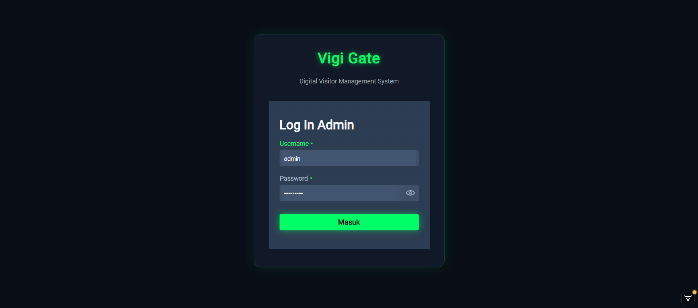
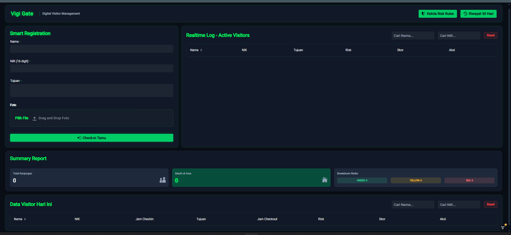
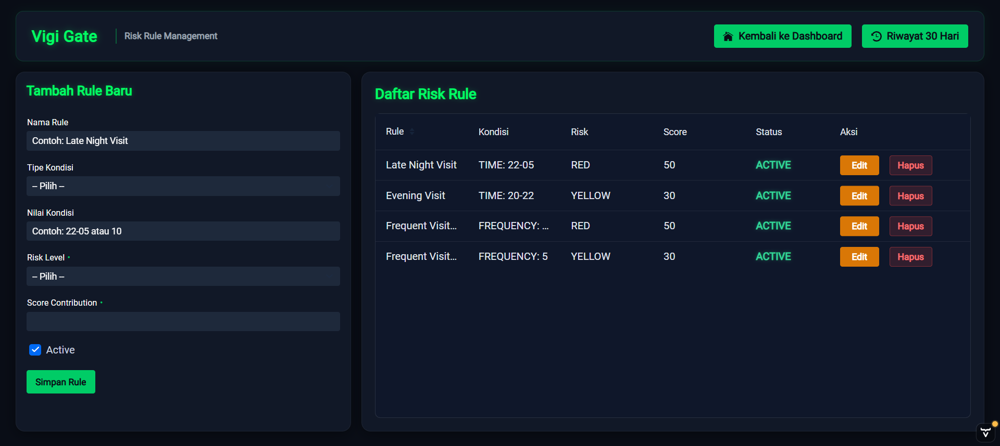
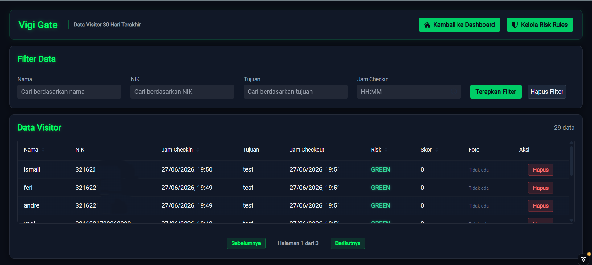

# Visitor Digital Gate

> Digital Visitor Management System berbasis **Spring Boot** dan **Vaadin** untuk mencatat serta memonitor tamu yang berkunjung ke area perkantoran secara realtime.

---

# Screenshot

## Login



---

## Dashboard



---

## Risk Rules



---

## Visitor History



---

# Deskripsi

Vigi Gate merupakan aplikasi **Visitor Management System (VMS)** yang digunakan untuk melakukan proses registrasi tamu, monitoring tamu yang sedang berada di area kantor, serta pencatatan histori kunjungan.

Aplikasi dikembangkan menggunakan:

- **Backend** : Spring Boot 3
- **Frontend** : Vaadin Flow
- **Database** : PostgreSQL
- **Build Tool** : Gradle
- **Java Version** : Java 21

Seluruh antarmuka aplikasi dibangun menggunakan Vaadin sehingga tidak memerlukan framework frontend terpisah seperti React atau Angular.

---

# Fitur

## Smart Registration

- Registrasi tamu
- Validasi NIK 16 digit
- Input tujuan kunjungan
- Upload foto tamu
- Check-In tamu

---

## Realtime Active Visitors

Menampilkan seluruh tamu yang masih berada di area kantor.

Informasi yang ditampilkan meliputi:

- Nama
- NIK
- Tujuan
- Risk Level
- Skor
- Aksi Checkout

---

## Summary Report

Dashboard ringkasan yang menampilkan:

- Total kunjungan
- Jumlah tamu yang masih berada di area
- Breakdown kategori risiko

---

## Visitor History

Menyimpan histori kunjungan tamu meliputi:

- Nama
- NIK
- Jam Check-In
- Jam Check-Out
- Tujuan
- Risk
- Skor

---

## Search

Mendukung pencarian data berdasarkan:

- Nama
- NIK

---

# Persyaratan

Pastikan telah menginstall:

- Java 21
- Gradle 8.14
- PostgreSQL

# Clone Project

```bash
git clone https://github.com/anaf-prog/Visitor-Digital-Gate
```

```bash
cd vigi-gate
```

---

# Konfigurasi Database

Sesuaikan file

```
src/main/resources/application.properties
```

Contoh

```properties
spring.datasource.url=jdbc:postgresql://localhost:5432/vigigate
spring.datasource.username=postgres
spring.datasource.password=password

spring.jpa.hibernate.ddl-auto=update

cloudinary.cloud-name=abcde
cloudinary.api-key=0123
cloudinary.api-secret=YouRsEcrET
```

---

# Menjalankan Aplikasi

Menggunakan Gradle

```bash
./gradlew bootRun
```

Windows

```powershell
gradlew.bat bootRun
```

Aplikasi akan berjalan pada

```
http://localhost:8082
```

---

# Build Project Development

```bash
gradle clean build
```

# Build Project Production

```bash
gradle clean build "-Pvaadin.production-mode=true"
```

Build akan menghasilkan folder:

```
install/
```

berisi

```
install
│
├── Vigi-Gate-<build-version>.jar
│
├── lib
│   ├── *.jar
│
└── config
    ├── application.properties
    ├── logback-spring.xml
    └── *.xml
```

Folder **install** sudah siap digunakan untuk deployment atau production.

---

# Build Version

Project menggunakan build version otomatis dengan format

```
yyyyMMdd-buildNumber
```

Contoh

```
20260628-1

20260628-2

20260628-3
```

Setiap proses build akan menaikkan build number secara otomatis.

---

# Deployment

Jalankan aplikasi menggunakan folder install.

Contoh

```
install
│
├── Vigi-Gate-20260628-5.jar
├── lib
└── config
```

Menjalankan aplikasi

```bash
java -jar Vigi-Gate-20260628-5.jar
```

Seluruh konfigurasi dibaca dari folder

```
config/
```

sehingga perubahan konfigurasi tidak memerlukan proses build ulang.

---

# Production Mode

Saat proses build:

- Vaadin Production Mode akan diaktifkan otomatis.
- Logging Vaadin akan diturunkan menjadi WARN.
- Konfigurasi Logback akan menggunakan file eksternal.

Perubahan ini dilakukan otomatis oleh task Gradle.

---
